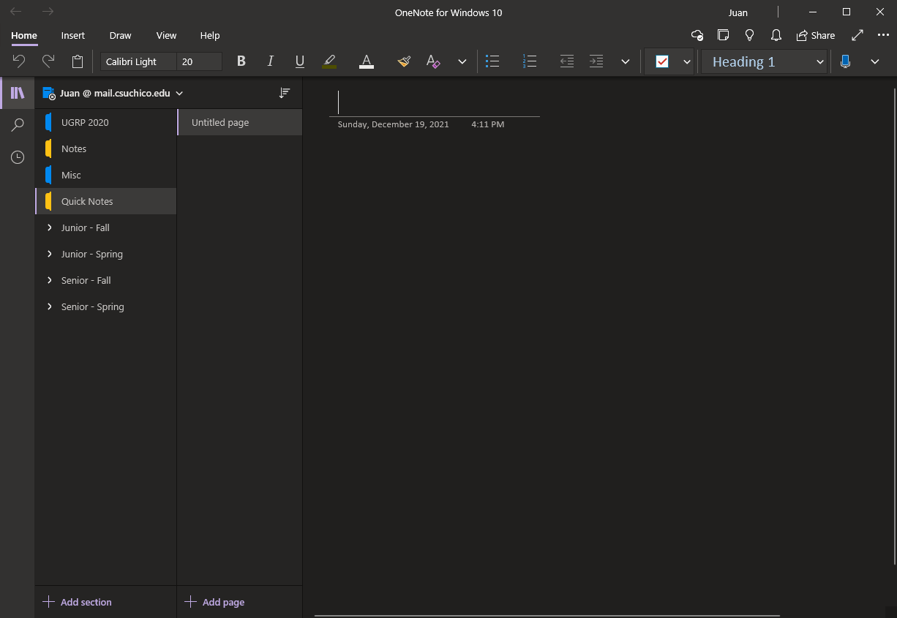
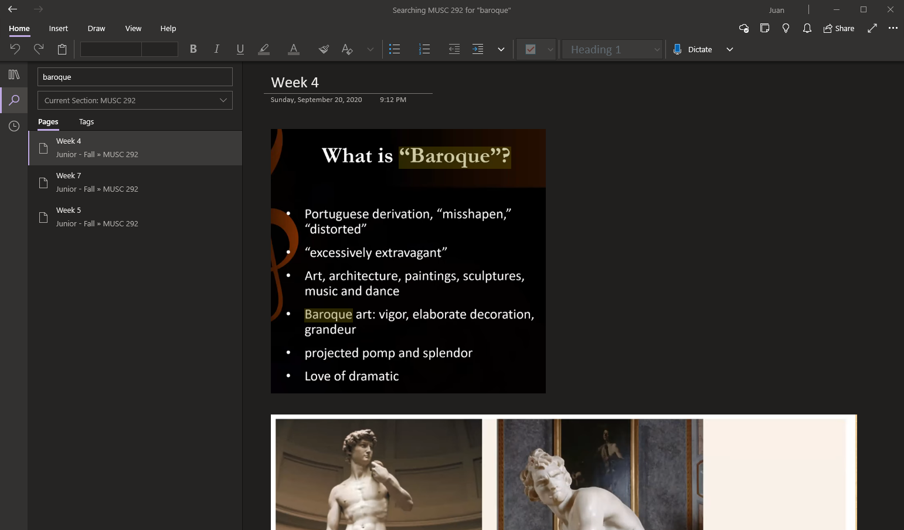

# j01 - One Note for Windows 10
## By Juan Aguirre-Ayala - 2/25/2022

One Note is a note-taking application developed by Microsoft, offered as a stand-alone app or a part of the Microsoft Office suite. You can sign in with a Microsoft account to save your notes and access them across devices. It also has many other features such as multi-user collaboration, audio recording, and drawing. 

I started using One Note for note taking primarily when classes went fully virtual, and I was able to type/write notes down pretty quick. It's interface is somewhat similar to any typing application (i.e. Microsoft Word, Google Docs), offering different fonts, font sizes, bold, italics... so it's **learnability** is high for someone that has used other typing applications. I also find the **satisfaction** quite high as you can organize your notes by sections, categorize them, and color code them.

Something I quite enjoyed with the application is it's search feature. The thing that set this a part from other note taking apps is that you can search for words within pictures. So, I was able to take screenshots of notes/slides in a lecture, and then be able to search them up. For example: I took MUSC 292, and I took screenshots of the slides that were shown. If I wanted to search up about "baroque", it'll find instances of the term in images that I put up on my notes. I feel that this is extremely **useful**, as I can take quick screenshots of notes and then quickly search them up. 

Overall, I found One Note to be a satisfyingly efficient app to use for note-taking, and I'd recommend it to anyone looking to take notes on their Windows machine.
