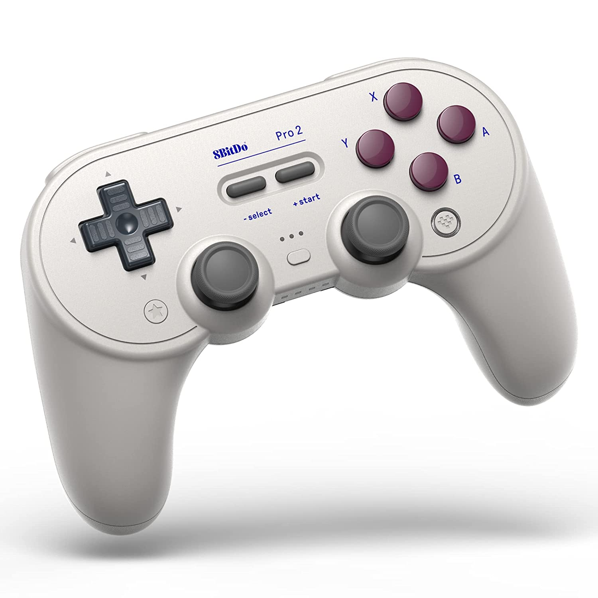
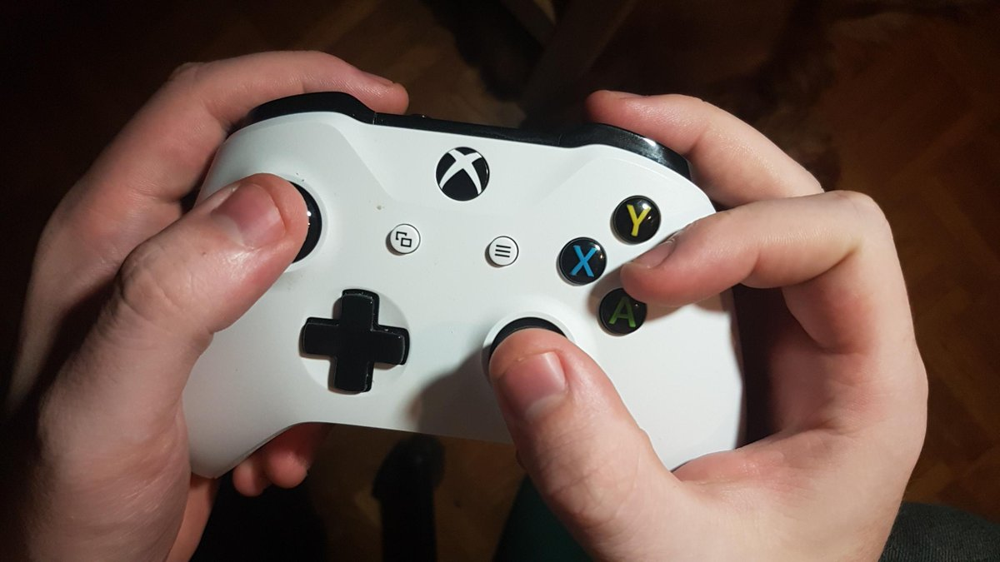
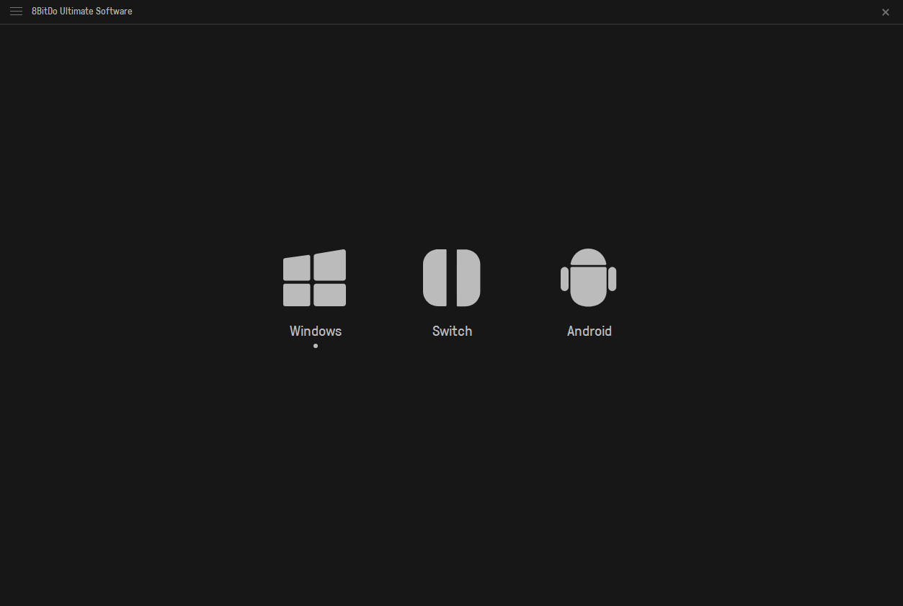
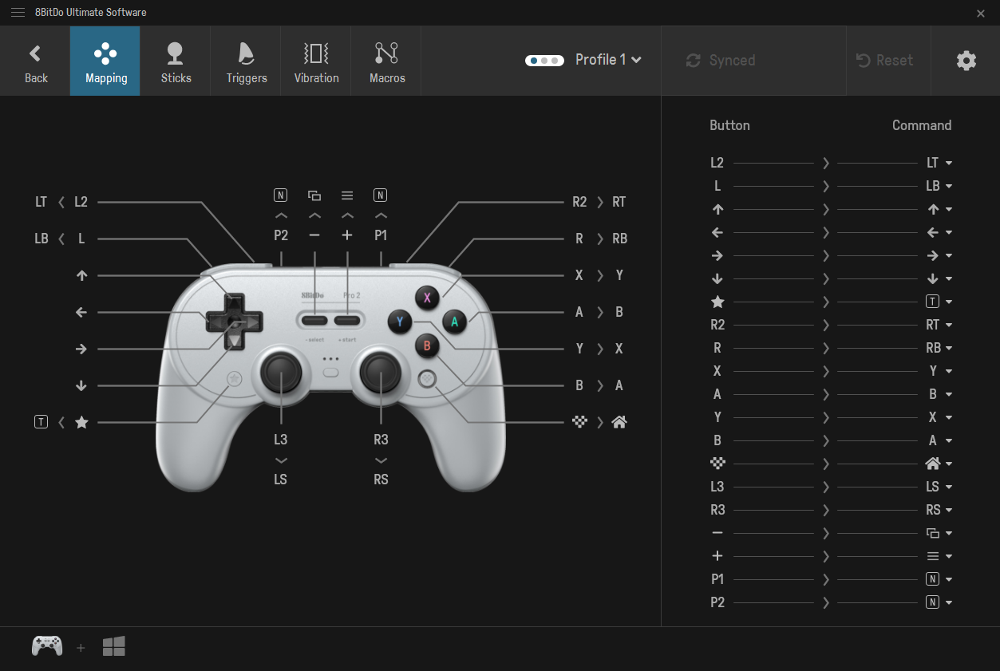
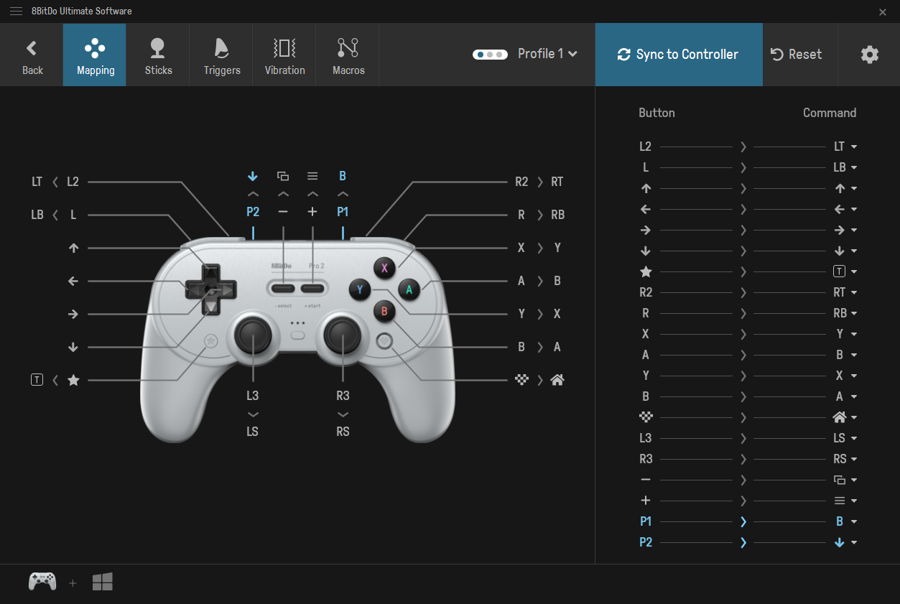
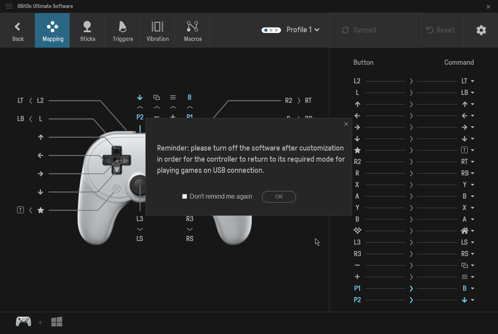

# j02 - 8BitDo Ultimate Software
## By Juan Aguirre-Ayala - 4/15/2022

I bought a controller from 8BitDo called the 8BitDo Pro 2. I've always loved the SNES controller, so all the additions to bring the SNES controller up to modern controller standards was a big selling point for me. I downloaded software from their website that would allow me to customize the mappings, sensitivities, and macros. 

The customizability is a big plus for me. While I don't have any issues with how the controller is laid out, there are some games (i.e. FromSoftware games) that have some questionable button mappings that would lead me to have to hold the controller in a claw grip. My main goal for this experience is to go into the software, see if I can map a front facing button to one of the paddles in the back of the controller.

So, the software requires me to have my controller plugged in so it can sync any changes I make in the software to the controller's hardware. I'm prompted with the three main platforms that are supported on the controller. Simple and to the point, which I feel is **efficient** in terms of the target audience. If someone realizes something is off with their mapping, they can quickly plug in, launch the software, and they aren't bombarded with unnecessary stuff. It's a bit refreshing since most software that comes with peripherals these days (i.e. printers, keyboards, mice) will tend to take up a lot of space, bombard you with unnecessary stuff, and overall be a drag to work with. 

Now that I've moved onto the platform that I'll be configuring my controller for, I am greeted with a whole lot of letters pointing to parts of the controller. It's a lot to take in at first, but for someone that has used a gaming controller before, it's easy to get a grasp of what you're looking at. My first instinct was to interact with the A > B that is near the center of the window, but then I realize that the entire left side of the window cannot be interacted with, and it's just to show what the buttons are mapped to (the physical A button on the controller will actually register as a B button in a game). I realized that my point of interest is the right side of the window, where there are triangles pointing downwards which indicate that I can interact with it. From here, I use the image diagram on the right to see which paddle (P1 / P2) I want to map B to.

Once I make my decision, the "Sync to Controller" button at the top lights up, which indicates to me that I can click it and save the setting to my controller. I find this **effective** because it gives the user a solid indication that the changes they made are valid and can be saved to the controller. It's good design to have it greyed out at first when there are no changes in place, but once a change takes place, then the button will light up for the user as it is an area of interest. If the button just stayed the same throughout this interaction, then I feel like it would be difficult for me or any user to realize they can go and save the changes they just made.

I save my changes, and the software gives me a nice reminder to close the software so I can play games without any issues. I close the software, and I see that my button mappings work. Overall, I felt like the experience with the software was positive as it was quick and straight-forward. The simple "get in and get out" mentality recognizes the target audience of people that just want to quickly customize their controller. 
