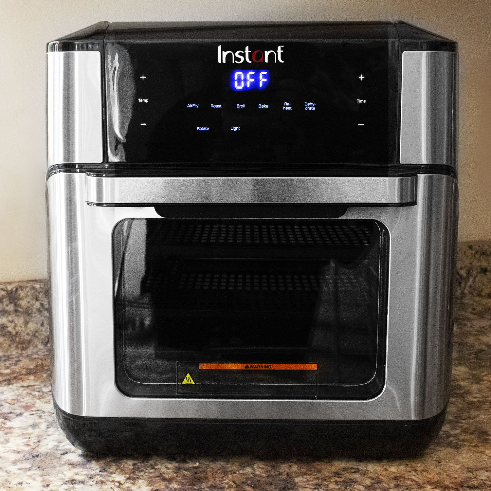
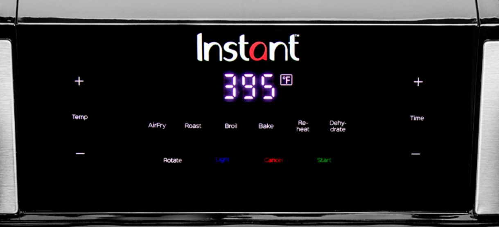

# j03 - InstantTM VortexTM Plus 10-quart Air Fryer Oven
## By Juan Aguirre-Ayala - 5/17/2022

The InstantTM VortexTM Plus 10-quart Air Fryer Oven is something my family picked up after the previous air fryer that we owned stopped working. It's advertised as sleek, versatile, and convenient, so I wanted to evaluate the usability of the interface panel when trying to get something cooked. 

The default state of the air fryer is displayed through the old-school LCD display saying "OFF". From here, you can tap on one of the six cooking options. Since the buttons are digital, the feedback from pressing this is an audible beep along with the LCD display changing, which is **satisfying** as it lets the user know that there is change going on, despite not getting physical feedback. So after getting some food in and selecting my option, I naturally gravitated towards the sides to adjust the temperature and time. Since there is only one LCD display, it would switch between temperature and time depending on what was last pressed. 

Starting the air fryer, the buttons remain lit. If I realize I made an error in the cooking temp/time, I can hit the red "Cancel" button and it'll halt the cooking and I can proceed with my changes. There is good **error tolerance** as the cooking process isn't locked in for the full duration. The color **conventions** used for the "Cancel" and "Start" make sense to me and are good **indicators** of what they will do even if someone hasn't fully read them.

What if someone starts the air fryer with no food? The interface actually does a good job of indicating that. It'll detect that there is no food in the air fryer, and it'll let out an audible beeping noise with an error message indicating to "add food". I feel like this is good **safety** as it calls to attention an error that has to be corrected to prevent any accidents. 

Something that I noticed that this air fryer lacks compared to other air fryers is pre-set food options, such as frozen, chicken, fries, etc. This would decrease the **efficiency** of this appliance as there'd be more time wasted trying to look for the specific cooking instructions on food packaging. There are some cases where food packaging doesn't have specific air frying instructions, so one would have to look it up manually on their phone to get some idea on how to cook it, resulting in even more time wasted. Despite the company website advertising that there are 6 customizable programs, I couldn't figure out if there was a hidden way to access this.

Overall, this air fryer gets the job done with it's simple interface, despite lacking some features that it promised. 
